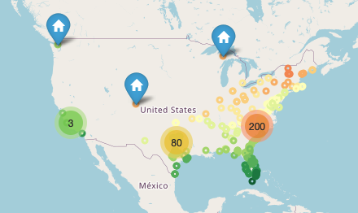

# Adding USDA Hardiness Zones to GBIF Occurence Data

#### [View in Gitub pages](https://abarbieu.github.io/Plant-Hardiness-Zones-GBIF/)

This repository contains code for querying GBIF occurrence data for the United States and plotting it on a map of the US, with USDA Hardiness Zones represented as color.

Hardiness zones were gathered from the [Open Plant Hardiness Zones Repository](https://github.com/kgjenkins/ophz).

First, you will need to run the script to fetch the data from GBIF, then it will query the data against a GeoJSON file to match the occurrences with their respective temperature. Finally, it will plot the data on a map of the US using folium.

Here is an example of the final output:

[Open map.html](https://abarbieu.github.io/Plant-Hardiness-Zones-GBIF/map.html)

Preview:

## Usage Instructions
---

1. Make sure you have the following dependencies installed:

    pygbif
    pandas
    numpy
    matplotlib
    geopandas
    folium

2. Clone the [Open Plant Hardiness Zones Repository](https://github.com/kgjenkins/ophz) into a folder named ophz

3. Enter the Jupyter Notebook and edit the third cell with your query information. Info available [via pygbif](https://pygbif.readthedocs.io/en/latest/modules/occurrence.html) (pdf found [here](https://buildmedia.readthedocs.org/media/pdf/pygbif/stable/pygbif.pdf)) and via the gbif docs [here](https://www.gbif.org/developer/occurrence)
